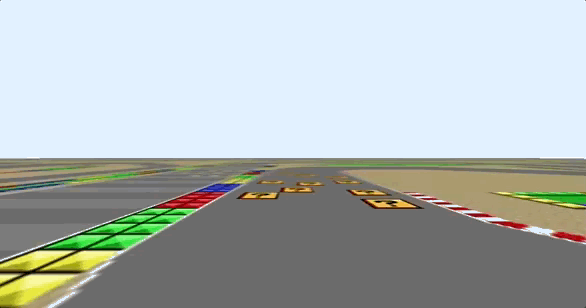

hexkart: Kart simulation for model training
================

Getting Started
---------------

Clone this GitHub repo and open the package project in RStudio, then launch this simulation as follows, you can turn left and right using your arroy keys:

``` r
library(hexkart)
hexkart_play()
```



To capture a kart session simply run:

``` r
hexkart_capture()
```

This will create a snapshot under `capture/` with labels: `###-left.png`, `###-forward.png` or `###-right.png` that you can use for training. Once trained, you can use `hexkart_control()` to feed predictions back. We can feed a random direction by running:

``` r
labels <- c("left", "forward", "right")
hexkart::hexkart_control(function(image, direction) {
  sample(labels, 1)
})
```

Training using TensorFlow
-------------------------

While `hexkart` is completely unrelated to `tensorflow` and can be used to capture and train a model using any package; this writeup explores using `tensorflow`, `keras`, `cloudml` and `tfdeploy` for training.

First we need to run `hexkart_capture()` to capture some training data. Then, we will first try modeling this as an image classification problem using the [cifar10\_cnn](https://tensorflow.rstudio.com/keras/articles/examples/cifar10_cnn.html) Keras example.

``` r
tfruns::training_run("models/tf-cifar.R")
```

or in `cloudml` runnning:

``` r
cloudml::cloudml_train("models/tf-cifar")
```

use `tfdeploy` to validate that predictions over the trained model work by running:

``` r
tfdeploy::predict_savedmodel(array(0, c(32,32,3)))
```

    $predictions
                      output
    1 0.3322, 0.3316, 0.3363

Notice that `predict_savedmodel()` initializes a tensorflow session for each prediction, which takes too long:

``` r
system.time(tfdeploy::predict_savedmodel(array(0, c(32,32,3))))
```

       user  system elapsed 
      2.007   0.045   2.027 

Instead, we can preload the model and predict over a `graph` object as follows:

``` r
sess <- tensorflow::tf$Session()
graph <- tfdeploy::load_savedmodel(sess)

system.time(tfdeploy::predict_savedmodel(array(0, c(32,32,3)), graph, type = "graph", sess = sess))
```

       user  system elapsed 
      0.027   0.001   0.025

Which we can use to control the kart based on this model:

``` r
hexkart::hexkart_control(function(image, direction) {
  input <- array(png::readPNG(raw), c(32,32,3))
  result <- tfdeploy::predict_savedmodel(input, graph, type = "graph", sess = sess)
  scores <- result$predictions$output[[1]]
  labels[which(scores == max(scores))]
})
```

As we can see bellow, using the CIFAR CNN example is not up to the task, yet:


